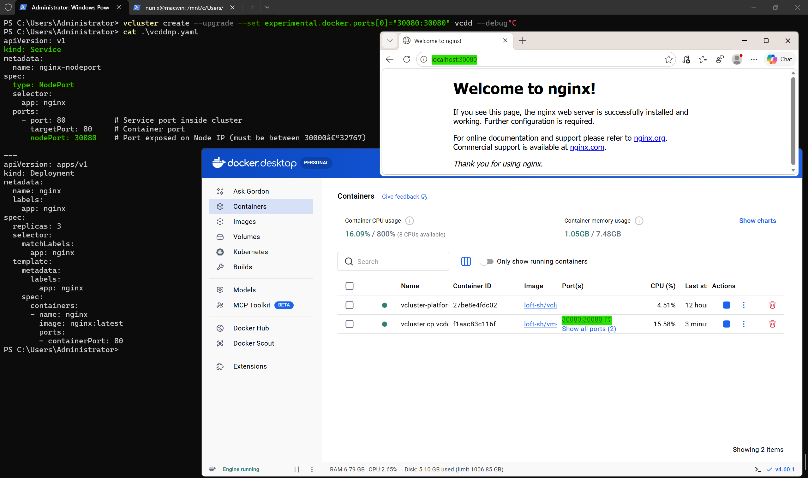

# vind on WSL2

## Prerequisites

### WSL

#### WSL installed

````powershell
wsl --install --no-distribution
````

Once installed, control the version

````powershell
wsl --version
WSL version: 2.7.0.0
Kernel version: 6.6.114.1-1
WSLg version: 1.0.71
MSRDC version: 1.2.6676
Direct3D version: 1.611.1-81528511
DXCore version: 10.0.26100.1-240331-1435.ge-release
Windows version: 10.0.26534.1000
````

For a better experience using container workloads, set the following settings

````powershell
cat .\.wslconfig
[wsl2]
swap=0
vmIdleTimeout=-1
[general]
instanceIdleTimeout=-1
````

List all the available distributions to install

````powershell
wsl -l -o
The following is a list of valid distributions that can be installed.
Install using 'wsl.exe --install <Distro>'.

NAME                            FRIENDLY NAME
Ubuntu                          Ubuntu
Ubuntu-24.04                    Ubuntu 24.04 LTS
openSUSE-Tumbleweed             openSUSE Tumbleweed
openSUSE-Leap-16.0              openSUSE Leap 16.0
SUSE-Linux-Enterprise-15-SP7    SUSE Linux Enterprise 15 SP7
SUSE-Linux-Enterprise-16.0      SUSE Linux Enterprise 16.0
kali-linux                      Kali Linux Rolling
Debian                          Debian GNU/Linux
AlmaLinux-8                     AlmaLinux OS 8
AlmaLinux-9                     AlmaLinux OS 9
AlmaLinux-Kitten-10             AlmaLinux OS Kitten 10
AlmaLinux-10                    AlmaLinux OS 10
archlinux                       Arch Linux
FedoraLinux-43                  Fedora Linux 43
FedoraLinux-42                  Fedora Linux 42
eLxr                            eLxr 12.12.0.0 GNU/Linux
Ubuntu-20.04                    Ubuntu 20.04 LTS
Ubuntu-22.04                    Ubuntu 22.04 LTS
OracleLinux_7_9                 Oracle Linux 7.9
OracleLinux_8_10                Oracle Linux 8.10
OracleLinux_9_5                 Oracle Linux 9.5
openSUSE-Leap-15.6              openSUSE Leap 15.6
SUSE-Linux-Enterprise-15-SP6    SUSE Linux Enterprise 15 SP6
````

````powershell
wsl --install --distribution
````


### Winget & Applications

Check the Winget version

````powershell
winget --version
v1.28.190
````

Install vcluster for Windows

````powershell
winget install --id loft-sh.vcluster
````

Install Docker Desktop

````powershell
winget install --id XP8CBJ40XLBWKX
````

## Test 1: Docker Desktop

Check no vcluster container is running

````powershell
docker container ls --all
````

Set the vcluster driver to docker

````powershell
vcluster use driver docker
````

Check that no vcluster is running

````powershell
vcluster list
````

Start the platform

`````powershell
vcluster platform start
`````

Create a new vcluster with a specific port to be used as NodePort

````powershell
vcluster create --upgrade --set experimental.docker.ports[0]="30080:30080" [cluster] --debug
````

Create a new deployment with a NodePort service

````yaml
apiVersion: v1
kind: Service
metadata:
  name: nginx-nodeport
spec:
  type: NodePort
  selector:
    app: nginx
  ports:
    - port: 80           # Service port inside cluster
      targetPort: 80     # Container port
      nodePort: 30080    # Port exposed on Node IP (must be between 30000-32767)

---
apiVersion: apps/v1
kind: Deployment
metadata:
  name: nginx
  labels:
    app: nginx
spec:
  replicas: 3
  selector:
    matchLabels:
      app: nginx
  template:
    metadata:
      labels:
        app: nginx
    spec:
      containers:
      - name: nginx
        image: nginx:latest
        ports:
        - containerPort: 80
````

Deploy the file

````powershell
kubectl apply -f [filename].yaml
````

The Docker Desktop on WSL2 port forwarding allows the service to be reached from Windows host



## Test 2: WSL only